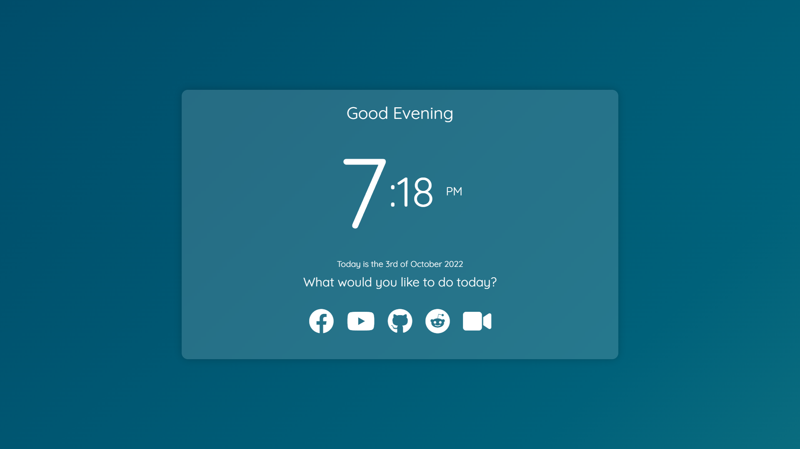

"Web Browser Homepage" is a custom homepage / new tab page built for web browsers.
  
</img>

Paste the following URL in your browser settings for your homepage: 
https://rawcdn.githack.com/k-capehart/Web-Browser-Homepage/41bc183f9ff9d8beb3ea12a4a25133b8d7fe5d78/index.html

Alternatively, pull down the repository and set your homepage URL to the local file path, i.e. 
`/Users/kcapehart/Documents/Web-Browser-Homepage/index.html`

Learn how to set a startup page / homepage in:
- [Google Chrome](https://support.google.com/chrome/answer/95314?hl=en&co=GENIE.Platform%3DDesktop#zippy=)
- [Firefox](https://support.mozilla.org/en-US/kb/how-to-set-the-home-page)
- [Safari](https://support.apple.com/guide/safari/change-your-homepage-ibrw1020/mac)
